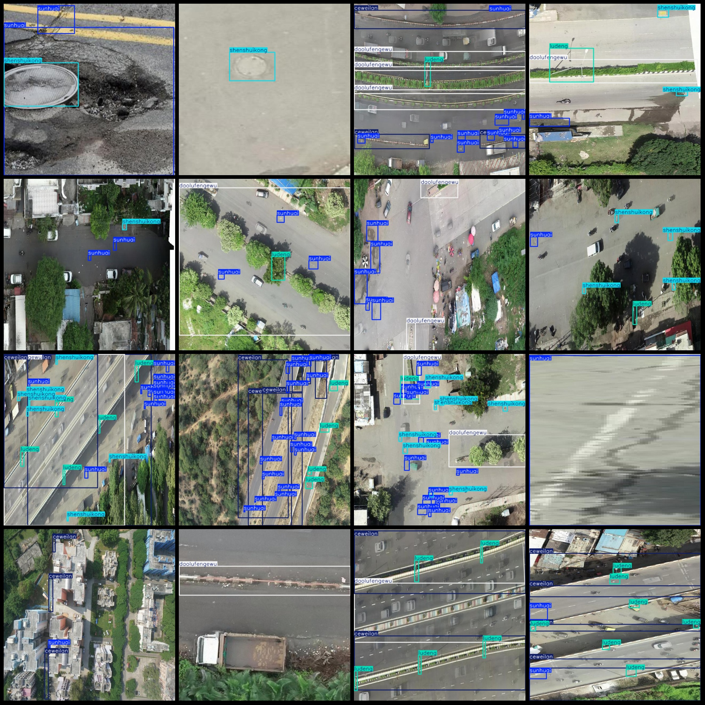
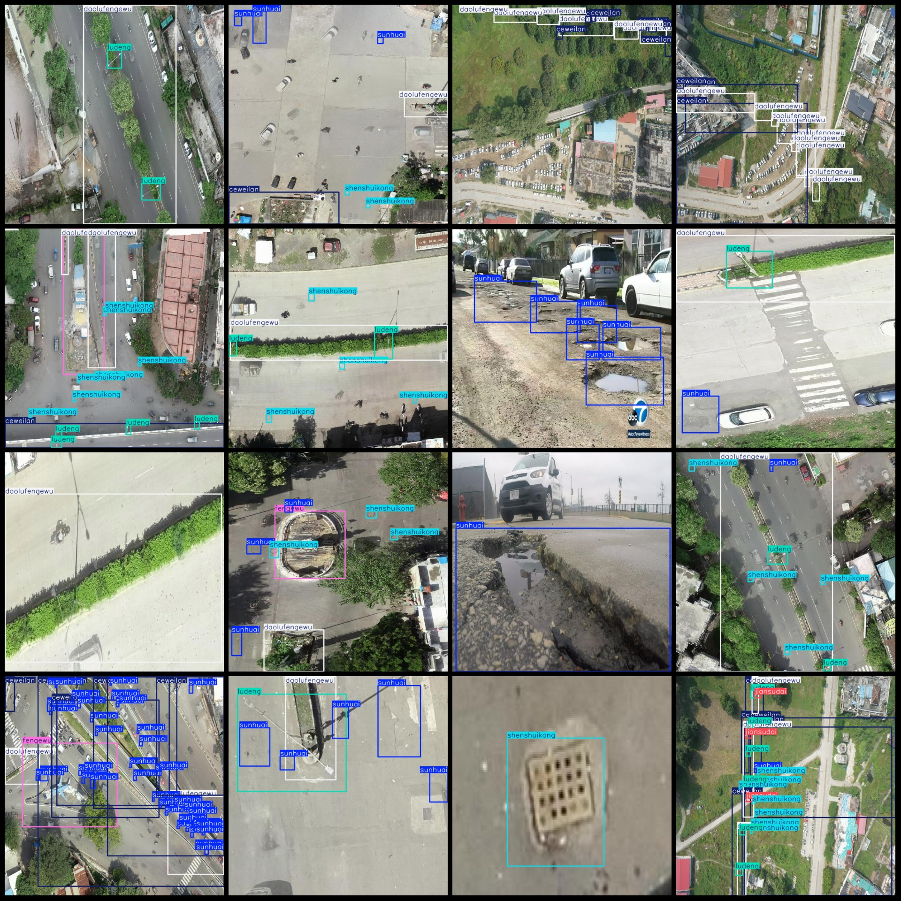

# Drone-Viewpoint aerial photography of road distress and facility inspection dataset VOC+YOLO format, 813 images in 8 categories

The dataset format is Pascal VOC format + YOLO format (the txt file does not contain the split path, it only contains jpg images along with the corresponding VOC format xml files and the YOLO format txt files).
The number of jpg files: 813
annotation count: 813  
The number of .txt files is 813.
It seems like there's a typo or misunderstanding in the provided text. The sentence "annotationnumber of classes: 8" doesn't make sense on its own and lacks context to determine its intended meaning.

To provide a proper translation, I need more information about what "annotationnumber of classes: 8" is supposed to convey. If you could provide the full sentence or context where this phrase appears, I would be able to assist you with an accurate and concise English translation.
The categories are labeled as follows: ["ceweilan", "daolufengewu", "fengewu", "jiansudai", "jiaotongdeng", "ludeng", "shenshuikong", "sunhuai"]
The corresponding Chinese category names are: "Side Fence", "Road Separator", "Separator", "Speed Breaker", "Traffic Light", "Lamp", "Water Leakage Hole", "Damage".
The number of boxes annotated within each category:
"ceweilan box count = 776" is a Chinese sentence translated into English. If you want to translate it into English, it would be "The number of frames in CWLan is 776."
The number of daolufengewu boxes is 846.
The question "fengewu box count = 51" does not provide enough information to determine a specific mathematical problem or formula. It seems like a typographical error or a misunderstanding. If you could provide more context or clarify the question, I would be able to assist you better.
The number of rectangles in a jiansudai is 24.
The number of frames in a jiaotongdeng is 8.
To solve the problem, we need to determine the number of "ludeng" frames in a sequence that is given as 816.

A "ludeng" frame is defined as a unit of time or a unit of measurement. In this context, it seems like there might be some confusion about what "ludeng" means, as it's not a standard term in mathematics or common usage.

Assuming that "ludeng" refers to a unit of time (e.g., seconds), we can use the formula for the number of terms in an arithmetic series:

$ \text{Number of terms} = \frac{\text{Total number of elements}}{\text{Common difference}} $

Given that the total number of elements is 816 and the common difference is not specified, we cannot calculate the exact number of "ludeng" frames. However, if "ludeng" is meant to represent a specific number of units of time, we would need to know the duration of each "ludeng" frame or the relationship between them.

Without additional information, we cannot provide a concrete answer.
The number of shenshuikong frames is 702.
Sunhuai Frame Count = 2267  
Total Frame Count: 5490  
Number of Images per Class:  
ceweilan Contains 258 Images,  
daolufengewu Contains 479 Images,  
fengewu Contains 41 Images,  
jiansudai Contains 13 Images,  
jiaotongdeng Contains 6 Images,  
ludeng Contains 338 Images,  
shenshikong Contains 260 Images,  
sunhuai Contains 512 Images,  
Image Resolution: 640x640,  
Labeling Tool: labelImg,  
Labeling Rules: Draw a square box around the class.  
Important Note: The dataset does not have separate training, validation, or test sets; you need to divide them yourself.
The dataset does not guarantee the accuracy of the trained model or weight files.
Preview of images:
## Images

Here is a pay link on Stripe ( https://buy.stripe.com/3cs8yP7sY87d0vu9AB ). Please contact me lonlonago@foxmail.com after funding $89, and I will send you a complete data files , thank you!

